### Вешаем Pingpub в облако на статику

- Форкаем/синхронизируем [репо Pingpub](https://github.com/ping-pub/explorer)

- Регистрируемся на [Vercel](https://vercel.com/signup) (желательно сразу через GitHub)

- Создаем новый проект

  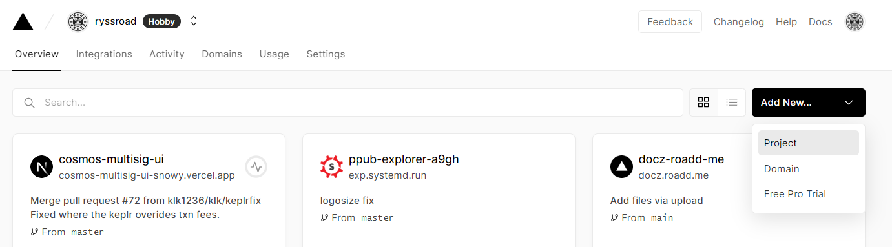
  
- Импортируем проект (наш форк)

  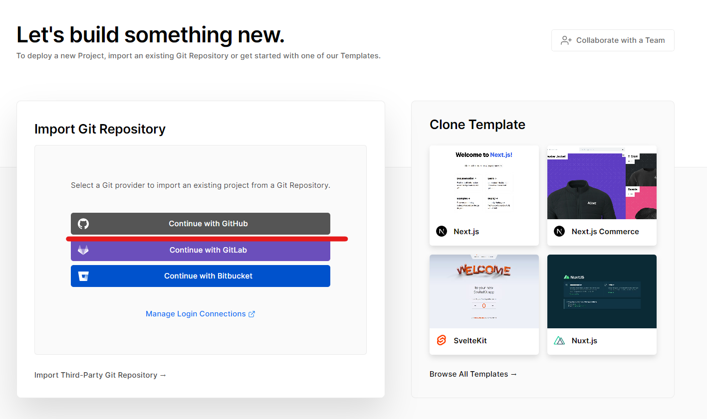

- Авторизуем доступ Netlify к GitHub аккаунту

- Выбираем наш форк

  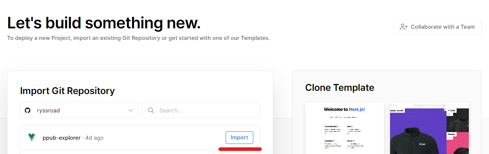

- Версель автоматически определяет среду для деплоя (Vue.js). Настройки импорта оставляем по умолчанию

  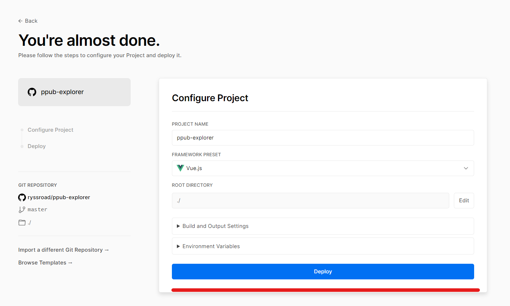

- Деплоим

  Процесс сборки занимает 4-5 минут. Можно посмотреть deploy log

  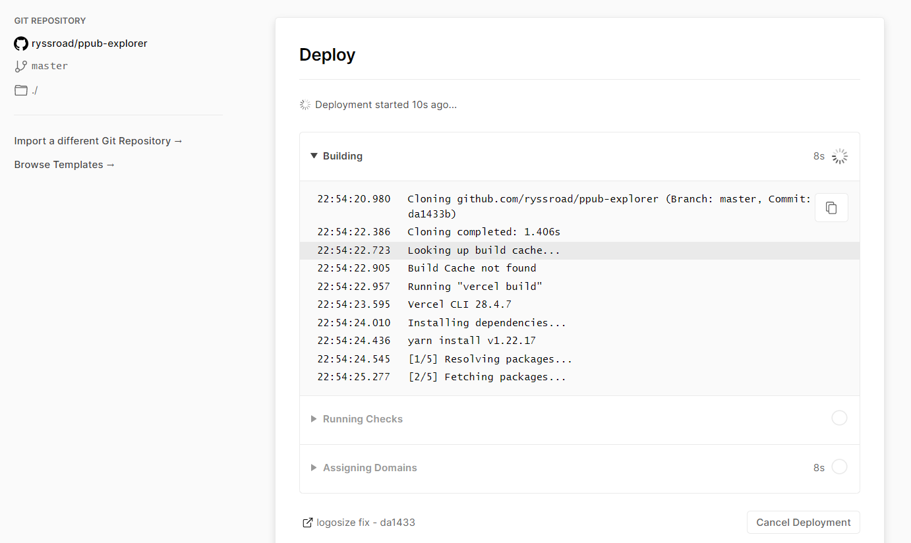

- Дожидаемся вот такого:

  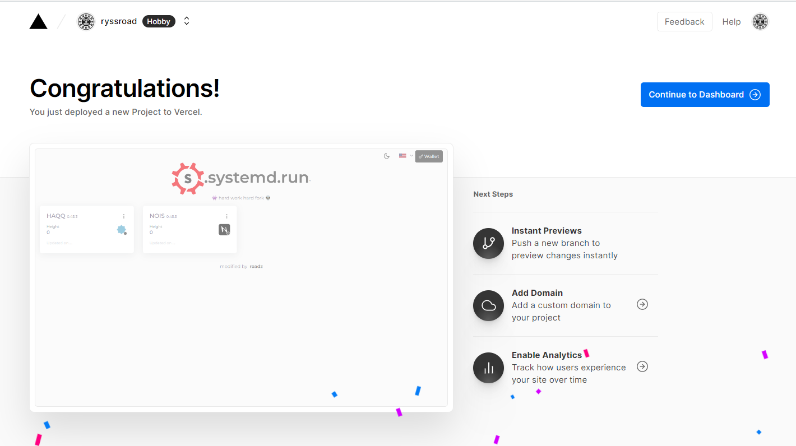

- Возвращаемся в овервью и видим что эксплорер развернут. Переходим по ссылке

  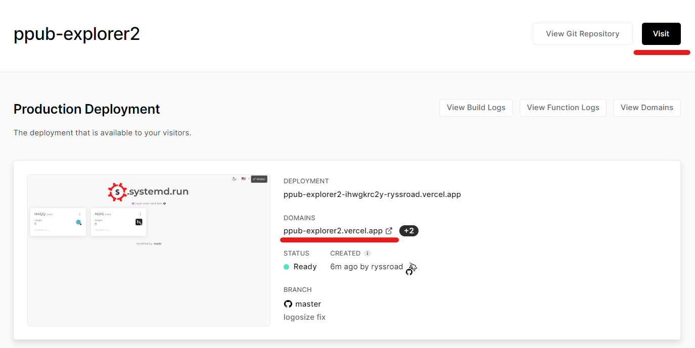

- Готово

  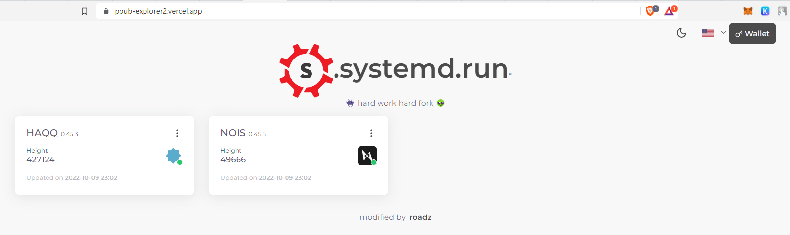

### Штрихуем

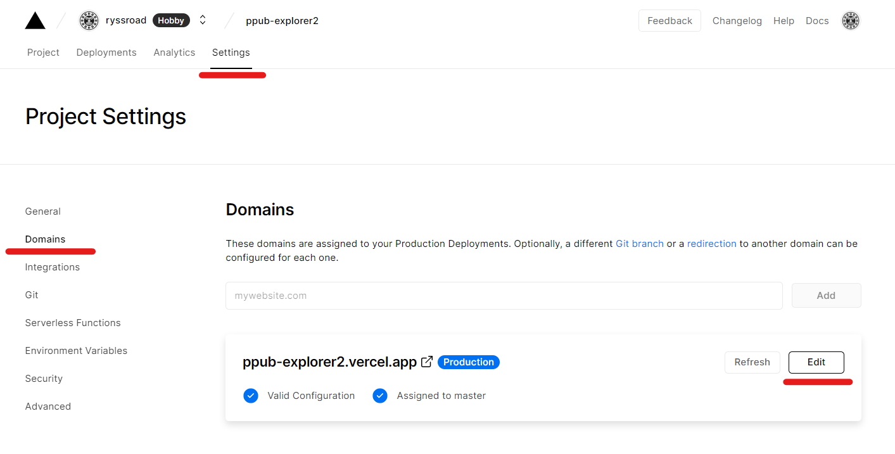

- Получаем человечью ссылку

  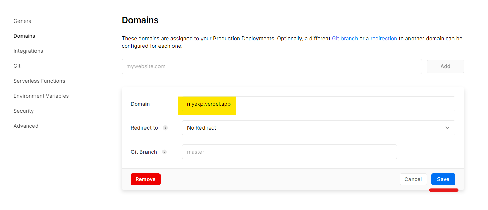

- Либо при наличии домена подключаем его

  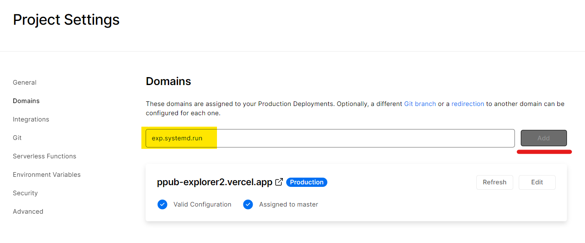

- Вносим требуемые изменения в DNS

  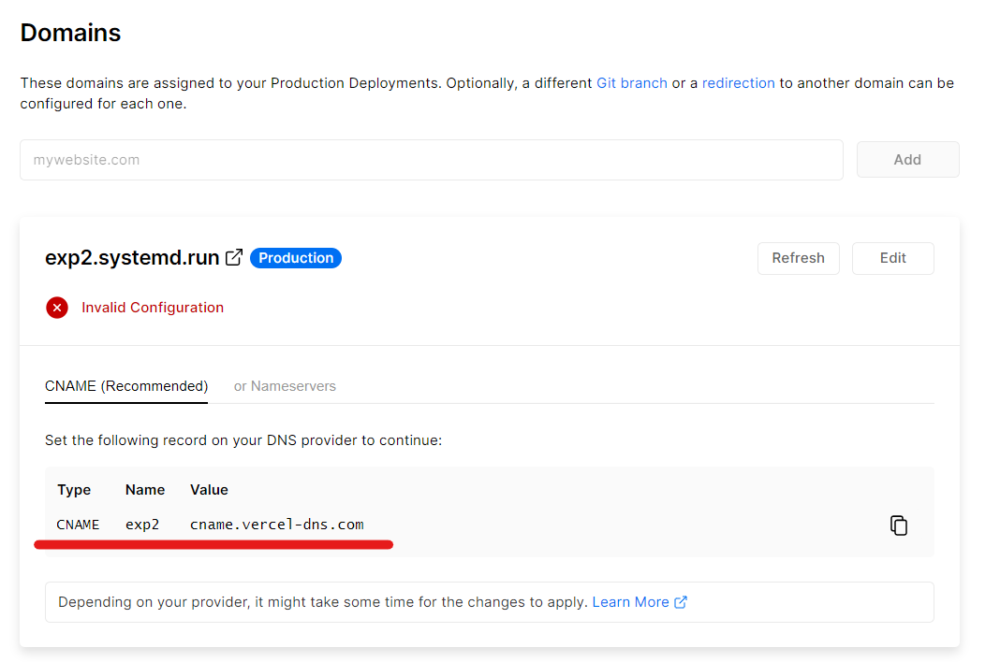

### Косметика и прочее

Здесь надо отметить, что Vercel будет автоматически ребилдить каждый коммит в вашем форке, что не всегда целесообразно, особенно при первоначальной настройке. Вследствии этого все манипуляции по удалению\добавлению сетей, замены лого, ссылок и прочего лучше производить на локале. Я использую [GitHub Desktop](https://desktop.github.com/). Клонируем форк и допиливаем все что надо. Ссылки приведены на основной репозиторий, кореллируем со своим форком:

- Лого загружаем [сюда](https://github.com/ping-pub/explorer/tree/master/public)

- Заголовок страницы меняем [здесь](https://github.com/ping-pub/explorer/blob/master/public/index.html#L16)

- Заголовок в навигации меняем [здесь](https://github.com/ping-pub/explorer/blob/master/themeConfig.js#L12). Здесь же смотрим остальные параметры, скин, анимацию и т.д.

- Заголовок главной страницы меняем [здесь](https://github.com/ping-pub/explorer/blob/master/src/views/Home.vue#L10)

- Ставим свои [ссылки на социалки](https://github.com/ping-pub/explorer/blob/master/src/navigation/vertical/index.js)

- Очищаем каталоги `src/chains/mainnet` и `src/chains/testnet` и загружаем туда конфиги своих сетей.

- Коммитим все изменения на десктопе разом, Netlify автоматически сбилдит коммит, никаких доп. движений не требуется

  

